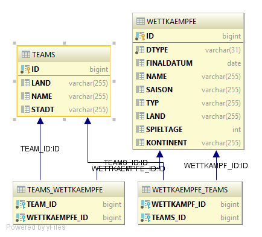

**

## Projektbeschreibung

**

In diesem Projekt wird eine Fußballwettkampf-verwaltung gemacht. Ein Fußballteam nimmt dabei an verschiedenen Wettkämpfen teil wie z.B.: Liga, Nationalercup und Internationalercup.
Die Wettkämpfe sind von der abstrakten Klasse Wettkampf abgeleitet.

Klassendiagramm

ERD

